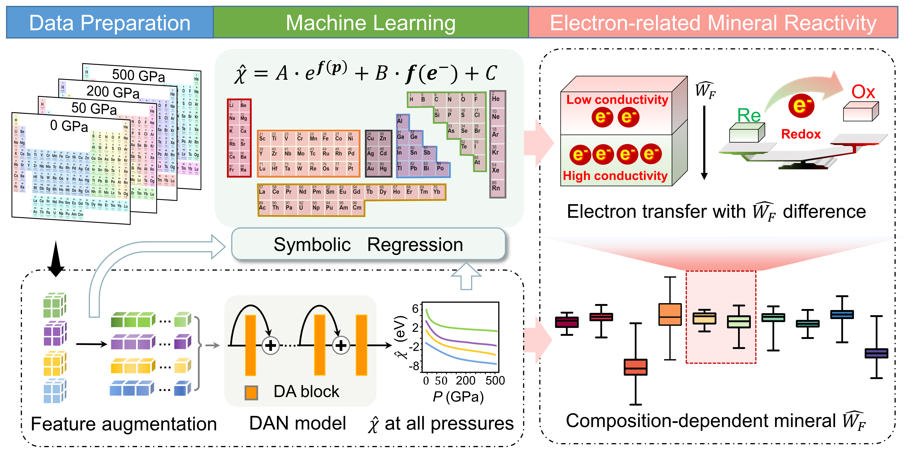
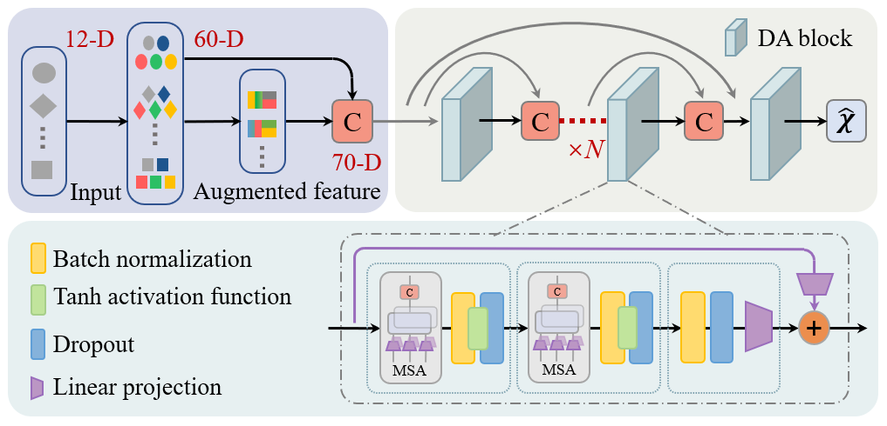
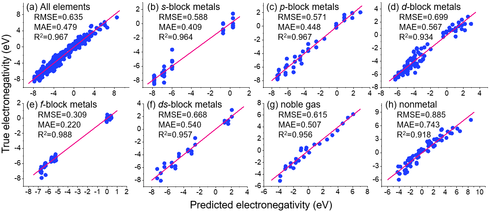

<p>
 <a href="https://doi.org/10.1038/s41467-023-37384-1">
     
 </a>
 <a href="https://doi.org/10.5281/zenodo.7709844">
     
 </a>
</p>

# Electron Transfer Rules of Minerals under Pressure informed by Machine Learning
Authors: Yanzhang Li†, Hongyu Wang†, Yan Li†\*, Huan Ye, Yanan Zhang, Rongzhang Yin, Haoning Jia, Bingxu Hou, Changqiu Wang, Hongrui Ding, Xiangzhi Bai\*, Anhuai Lu\*

This repo provides code and data to reproduce the results in the paper for ["Electron Transfer Rules of Minerals under Pressure informed by Machine Learning"](https://doi.org/10.1038/s41467-023-37384-1).

## 1. Introduction
<div align="center">
  
</div>

**Workflow designed to build deep learning and symbolic models for predicting electronegativity and the pressure-modulated relative work function**. Firstly, augmented-descriptor is generated using operation augmentation and symbolic transformer methods. Then, deep learning model Dense Attention Network (DAN) made of densely-connected DA blocks fits the data. Next, a trained DAN model was used to interpolate electronegativity under different pressures and symbolic regression was used to fit explicit analytical expressions for the data of each partition in the periodic table. Finally, deep learning model was utilized to calculate work function of 5828 minerals, and electronegativity formulization helps interpret electron transfer rules driven by work function difference.

<div align="center">
  
</div>

**Schematic diagram of feature augmentation (the top-left component) and Dense Attention Network (DAN) (the top-right component) 
in deep learning model to acquire predicted element electronegativity**. Augmented-descriptor is generated using operation augmentation and symbolic transformer methods, increasing the dimensionality of features from initial 12 to 70. A deep learning model Dense Attention Network (DAN) fits the data. DAN consists of densely-connected DA blocks, which includes Multi-head self-attention module (MSA), Batch Normalization, Dropout, Linear Projection and Tanh activation function. 

## 2. Environment
We are good in the environment:
```
ubuntu 18.04 or Windows 10
python==3.7
jupyter==1.0.0
autogluon==0.3.1
pandas==1.1.5
pysr==0.7.0
pytorch-tabnet==3.1.1
torch==1.9.0
gplearn==0.4.1
numpy==1.21.6
einops==0.4.1
pymatgen==2022.0.17
matplotlib==3.3.4
scikit-learn==0.24.1
```

## 3. Usage
a. clone the repo
```
git clone git@github.com:GCaptainNemo/Electronegativity-Under-Pressure.git
```

b. install dependencies
```
python -m pip install -r requirements.txt
```

c. use trained DAN to predict electronegativity. 
```
//// method 1
jupyter notebook
// open src/predict/predict_en.ipynb
// API predict_element_pressure：Calculate the electronegativity of an element under a specific pressure
test_obj.predict_element_pressure("H", 0)
// output: H at 0.0Gpa pred_en: 3.8928

// API predict_formula_pressure：Calculate the workfunction of a mineral under a specific pressure
test_obj.predict_formula_pressure("Mg1.6Fe0.4SiO4", 0)
// output: Mg1.6Fe0.4SiO4 at 0.0Gpa pred_en: 3.433850826739417


//// method 2
cd src/predict
python test_obj.py H 0 e
// output: H at 0.0Gpa pred_en: 3.8928
python test_obj.py Mg1.6Fe0.4SiO4 0 w
// output: Mg1.6Fe0.4SiO4 at 0.0Gpa pred_en: 3.433850826739417
```
d. train the Dense Attention Network (DAN) 

```
cd src/neural_net
python main.py
```

e.  acquire empirical formulas
```
cd src/find_formula
python find_formula.py
```
### 3.1 Docker Support
To further facilitate the building process, we add docker in our code. To run with docker, first make sure [docker](https://docs.docker.com/engine/install/ubuntu/) are installed on your machine. You can pull and run the built image by running the following command. 
```
cd docker
chmod +x docker_start.sh && ./docker_start.sh
chmod +x docker_into.sh  && ./docker_into.sh
```

## 4. Datasets
All data sets are in the `./data` folder, including original elment electronegativity data set (en_pressure.csv), augmented elment electronegativity data set (augment_en_pressure.csv), minerals data set (5828_minerals.csv) and output minerals workfunction data set (5828_minerals_0_100.csv).


## 5. Results
The Comparison of the performance on the element electronegativity testing set is shown in the table below.

|        |  RMSE | MAE | R<sup>2</sup> 
|--------|:---------:|:-------:|:-------:|
| Ours (DAN) | **0.425** |  **0.283** | **0.987** |
| TabNet | 0.969 | 0.817 | 0.943 |
| NeuralNetFastAI | 0.624 | 0.457 | 0.972 |
| CatBoost | 0.556 | 0.379 | 0.978 |
| XGBoost | 0.590 | 0.461 | 0.969 |
| LightGBM | 0.521 | 0.363 | 0.979 |
| Random Forest | 0.620 | 0.430 | 0.973 |

**Notes:**

* Our models are trained with pytorch 1.8.1, 2080Ti GPU and are available at [website](./result/training_result/baseline_model/ensemble_baseline.pth).
* There are two element electronegativity data sets: the [original data set](./data/en_pressure.csv) and the [feature augmentation](./data/augment_en_pressure.csv) data set. All methods are compared on the feature augmentation data set.
* The code of the comparison method TabNet refers to [website](https://github.com/dreamquark-ai/tabnet).
* Other comparison methods are implemented using [Autogluon](https://github.com/awslabs/autogluon).

The Fitting performances of empirical formulas are shown in the table below.
<div align="center">
  
</div>

## 6. Acknowledgements
Sincere thanks go to Prof. Xiao Dong and Artem R. Oganov for their pioneering work (doi: 10.1073/pnas.2117416119) that provided the 96 element electronegativity under 4 pressure values (0, 50, 200 and 500 GPa).

## 7. Citation
If you want to cite the article, please refer to the publication:

Li, Y., Wang, H., Li, Y. et al. Electron transfer rules of minerals under pressure informed by machine learning. Nat Commun 14, 1815 (2023). https://doi.org/10.1038/s41467-023-37384-1